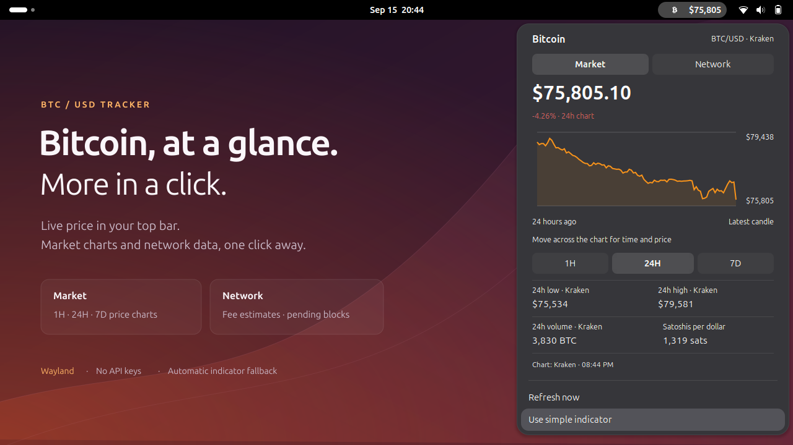
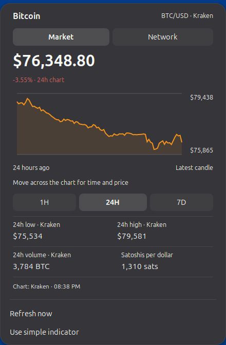
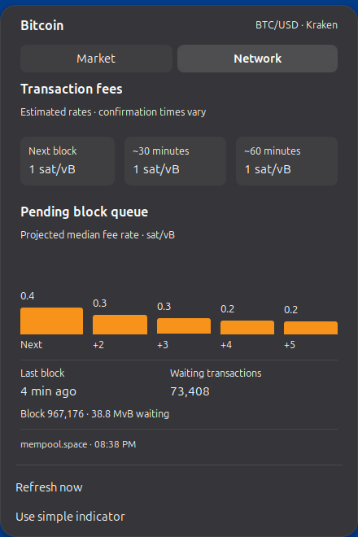
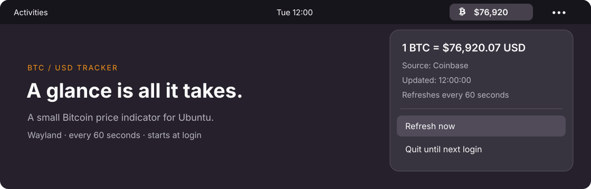

# BTC/USD Tracker

[](https://github.com/saschb2b/btc-usd-tracker/actions/workflows/ci.yml)
[](LICENSE)
[](#compatibility)

**Bitcoin's dollar price in your Ubuntu top bar, with a dashboard one click away.**

A native GNOME popover adds **Market** and **Network** tabs to the always-visible
BTC/USD price. A small standalone indicator runs alongside it and automatically
takes over when the popover is disabled or unavailable. Works on Wayland, starts
at login, and needs no account or API key.



*The real tracker running on GNOME 50 and Wayland, captured with a presentation
backdrop. The panel, community Bitcoin icon, and open popover are the actual UI.*

<details>
<summary>Explore the Market and Network tabs up close</summary>

| Market | Network |
| --- | --- |
|  |  |

*Actual screenshots from an isolated GNOME 50 Wayland session. Prices and network
conditions change. The top-bar Bitcoin icon is unchanged
[Bitcoin Design Community artwork](NOTICE.md).*

</details>

## Features

### Market

- Current USD quote, with cents in the popover and a rounded top-bar label.
- **1H / 24H / 7D** price charts; move across a chart to inspect time and price.
- Percentage change and high/low for the selected chart period.
- Kraken's rolling 24-hour BTC volume and satoshis per US dollar.
- Kraken quotes with Coinbase fallback; history comes from Kraken.

Charts use 1-minute, 15-minute, and 1-hour candles respectively. Each plotted point
is a candle's closing price; the latest candle is still forming. Percentage change
compares the first candle's open with the latest close. Period boundaries follow
candle intervals, so the displayed range is approximate. High/low includes candle
extremes, which can extend beyond the plotted closing prices.

### Network

- Estimated fee rates for the next block, about 30 minutes, and about 60 minutes.
- A bar chart of median fee rates in the next five projected blocks.
- Latest block age and height, pending transaction count, and queue size.
- Data from mempool.space. Fee estimates and confirmation times are approximate.

**sat/vB** means satoshis per virtual byte, the unit for transaction fee rates.
**MvB** means one million virtual bytes. One bitcoin contains 100 million satoshis.

### Automatic fallback

The native popover announces its availability on the local session bus. The
standalone indicator hides and pauses its price refreshes while the popover is
running, then reappears and refreshes when the extension stops. There is no second
visible ticker. The fallback requires working AppIndicator support.

The fallback has a simple price menu with source, update time, **Refresh now**, and
**Quit until next login**. Its quotes use Coinbase first, then Kraken. Charts and
network data belong to the native popover.



*The original desktop illustration, showing simple-indicator mode with sample
prices and the same [Bitcoin Design Community artwork](NOTICE.md).*

## Quick start

### 1. Install desktop libraries

On Ubuntu:

```bash
sudo apt update
sudo apt install git python3-gi gir1.2-gtk-3.0 gir1.2-ayatanaappindicator3-0.1
```

Ubuntu normally includes **Ubuntu AppIndicators**. Check it is active:

```bash
gnome-extensions info ubuntu-appindicators@ubuntu.com
# If installed but disabled:
gnome-extensions enable ubuntu-appindicators@ubuntu.com
```

### 2. Install the tracker and popover

Run these commands in a terminal in your graphical desktop session:

```bash
git clone https://github.com/saschb2b/btc-usd-tracker.git
cd btc-usd-tracker
./install.sh --with-popover
```

Run the installer **as your normal user, without sudo**. It copies both components
to your user data directory, enables the extension, and starts the fallback as a
systemd user service.

**Log out and back in once to load the new GNOME extension.** Until then, the simple
indicator shows the price. The installer does not restart your desktop.

For **only the simple indicator**, use `./install.sh` on a fresh installation.
It starts immediately if AppIndicators is already active. Add `--no-start` to
install and enable service startup without restarting it now. With
`--with-popover --no-start`, extension files are copied but its enable setting is
left unchanged; enable it after logging back in if this is a new installation.

You can also install just the native extension ZIP from
[Releases](https://github.com/saschb2b/btc-usd-tracker/releases), using
`gnome-extensions install --force path/to/file.shell-extension.zip`. Log out/in,
then enable the UUID below. This does **not** install the automatic fallback.

## Using it

Click the top-bar price, choose **Market** or **Network**, and select a chart range.
**Refresh now** updates the quote and visible tab. Quotes refresh every 60 seconds;
additional datasets refresh while their tab is open. Each dataset keeps its own
update time. Cached data is kept in memory for the current session.

If a refresh fails, the last successful values stay visible with `*` and a stale
message. Data older than 150 seconds is also marked stale when the UI updates.
Missing data shows as unavailable. A failed history or network request does not
prevent the current-price feed from working.

Choose **Use simple indicator** to disable the popover and immediately reveal the
fallback. The action is available only while the fallback app is running. Restore
the popover with the Extensions app or:

```bash
gnome-extensions enable btc-usd-tracker@saschb2b.github.io
```

This is a display-only app, with no wallet or trading features.

## Update or remove

From your clone:

```bash
git pull --ff-only
./install.sh

# Stop both components, disable startup, and remove installed files:
./uninstall.sh
```

The updater also refreshes an already-installed popover, preserving whether you
have enabled or disabled it. Use `./install.sh --with-popover` to explicitly enable
it again. **Log out/in after an extension code update.** The fallback update takes
effect immediately. Uninstalling leaves your clone and unrelated files in place.

Useful service commands:

```bash
systemctl --user status btc-usd-tracker.service
journalctl --user -u btc-usd-tracker.service -n 20
systemctl --user restart btc-usd-tracker.service
```

## Compatibility

**Verified:** Ubuntu 26.04, GNOME Shell 50, Wayland.

| Component | Requirements |
| --- | --- |
| Native popover | GNOME Shell 50, GJS, Soup 3 (provided by the tested Ubuntu desktop) |
| Simple indicator / fallback | Python 3.10+, PyGObject, GTK 3, Ayatana AppIndicator 3, and a desktop that displays AppIndicators |
| Installer | systemd user services and a logged-in graphical session |

The native extension declares support for **GNOME 50 only**. On unsupported GNOME
versions, the simple indicator remains available if AppIndicators works. Other
distributions and desktop versions have not been verified. GTK selects Wayland
when available, with X11 as its fallback backend.

Other GNOME desktops may need the
[AppIndicator and KStatusNotifierItem Support extension](https://github.com/ubuntu/gnome-shell-extension-appindicator).

### Install locations

| Item | Default location |
| --- | --- |
| Fallback app and artwork | `~/.local/share/btc-usd-tracker/` |
| Native extension | `~/.local/share/gnome-shell/extensions/btc-usd-tracker@saschb2b.github.io/` |
| Service | `~/.config/systemd/user/btc-usd-tracker.service` |

The installer respects `XDG_DATA_HOME` and `XDG_CONFIG_HOME`. Use the same values
for installation, updates, and removal. GNOME must use the same data directory to
find the extension.

## Troubleshooting

**Only the simple menu appears after installation.** Log out and back in. Check
`gnome-extensions info btc-usd-tracker@saschb2b.github.io`, confirm GNOME 50, and
ensure user extensions are enabled in the Extensions app.

**The service runs but there is no icon.** The fallback is intentionally hidden
while the popover is running. If neither is visible, check AppIndicator support
and the extension status. The service journal reports fallback visibility changes.

**A chart or network tab is unavailable.** The datasets use different providers.
Check the source and stale message in that tab, then try **Refresh now**. A
Coinbase backup quote can still work when Kraken history is unavailable; Kraken
volume then shows as unavailable.

**`systemctl --user` cannot connect or GTK cannot open a display.** Run the
installer in your logged-in graphical desktop as your normal user, not root or a
headless SSH session.

**A desktop library is missing.** Install the APT packages above. The launcher uses
`/usr/bin/python3` to find Ubuntu's system libraries.

**A notice mentions deprecated `libayatana-appindicator`.** Ubuntu 26.04's library
emits this notice; the fallback still works on the tested desktop.

## Development

```bash
python3 -m unittest discover -s tests -v
gjs -m tests/test_data.js
python3 scripts/package.py
```

These tests need no network or running desktop; GJS is required for the JavaScript
tests. CI covers Python 3.10–3.14, extension data validation, and packaging.
`dist/` receives the native extension ZIP. See [CONTRIBUTING.md](CONTRIBUTING.md)
for the isolated GNOME test that checks live charts, failed refreshes, and
fallback switching.

## Data sources and credits

- [Kraken OHLC API](https://docs.kraken.com/api-reference/market-data/get-ohlc-data)
- [Kraken ticker API](https://docs.kraken.com/api-reference/market-data/get-ticker-information)
- [Coinbase spot-price API](https://docs.cdp.coinbase.com/coinbase-app/track-apis/prices)
- [mempool.space API](https://mempool.space/docs/api/rest)
- [Ubuntu AppIndicators](https://github.com/ubuntu/gnome-shell-extension-appindicator)
- [Bitcoin Design Community's Bitcoin Icons](https://github.com/BitcoinDesign/Bitcoin-Icons)

Public data requests go directly to these providers. There are no accounts, API
keys, analytics, or persistent price-history files. The simple indicator logs
quotes and request errors in the local systemd journal; native request failures
appear in GNOME Shell's journal.

Code: [MIT](LICENSE). Bitcoin artwork: [public domain, with upstream attribution](NOTICE.md).
